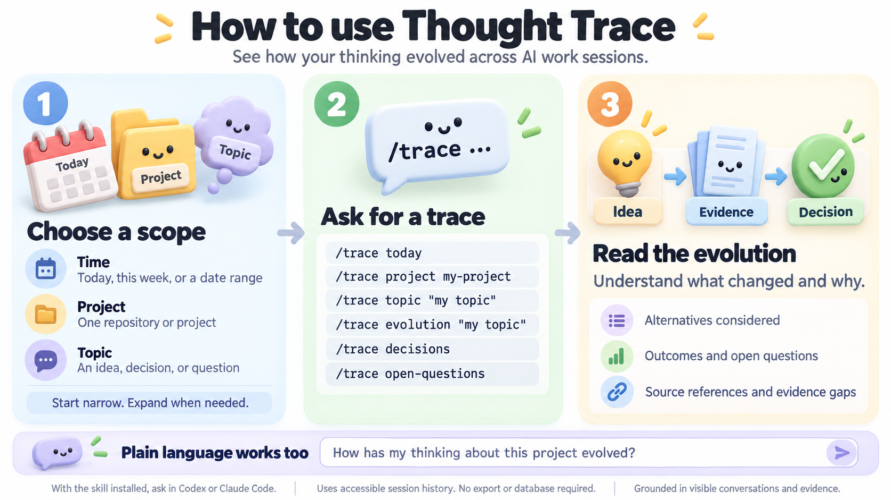

# Thought Trace / 思考轨迹

[中文](README.zh-CN.md)

**Version:** `1.0.0` · [Changelog](CHANGELOG.md)

**Repository:** [yysun/thought-trace](https://github.com/yysun/thought-trace)

Thought Trace reconstructs the observable evolution of your thinking across AI work sessions. It uses native Codex and Claude Code session history as evidence to explain how questions, decisions, alternatives, and unresolved issues developed over time.

It is not a transcript viewer and does not attempt to recover hidden model reasoning.



## Install

Link the skill into your global agent skills directory:

```sh
ln -s "$(pwd)/skills/thought-trace" ~/.agents/skills/thought-trace
```

The skill is then available as `thought-trace` or through its `/trace` invocation.

## Use

```text
/trace today
/trace this week
/trace project company-wiki
/trace topic "agent orchestration"
/trace evolution "LLM Wiki"
/trace decisions
/trace open-questions
```

Natural-language requests work too:

```text
How has my thinking about Company Wiki evolved?
Why did I move from traditional RAG toward LLM Wiki?
What architectural decisions did I make about Agent World this month?
```

## How It Works

Thought Trace reads accessible native session stores directly:

```text
Codex:       ~/.codex/sessions/
Claude Code: ~/.claude/projects/
```

It discovers candidate sessions from metadata first, selects those relevant to the requested date, project, or topic, then reads focused evidence. The result emphasizes conceptual transitions instead of a raw timeline.

When a source is unavailable, it reports that limitation and continues with the available evidence.

## Output

A trace uses only sections supported by the session evidence:

- Thought evolution
- Decisions and rationale
- Alternatives considered
- Changed or rejected approaches
- Outcomes
- Open questions
- Evidence scope and source provenance

## Design

Thought Trace is intentionally lightweight. It does not require a session exporter, database, index, daemon, or copied transcripts for normal use. Original host sessions remain the source of truth.

See the [product requirements](docs/Thought%20Trace%20-%20%E6%80%9D%E8%80%83%E8%BD%A8%E8%BF%B9%20%E2%80%94%20PRD.md) and the [skill instructions](skills/thought-trace/SKILL.md) for detail.
