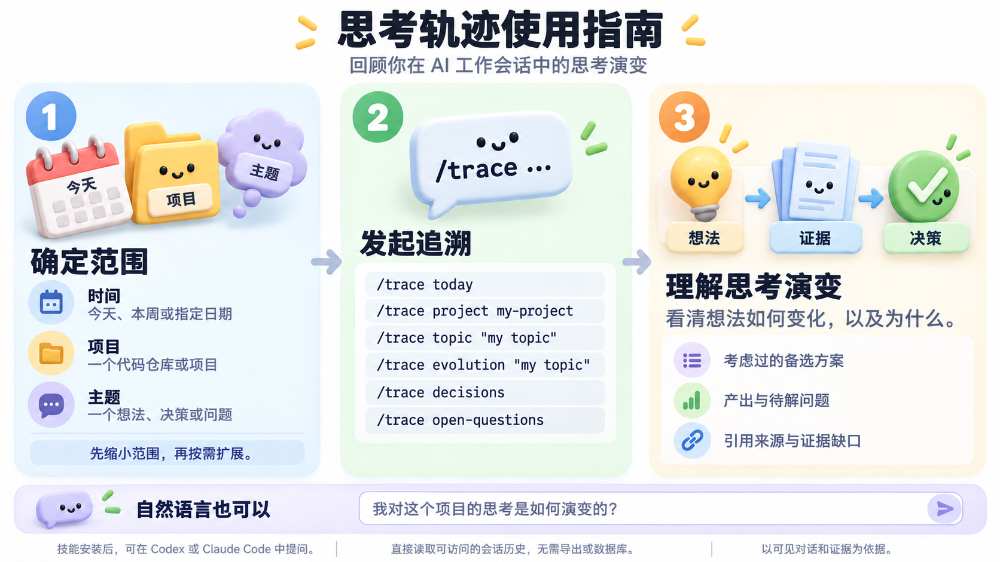

# Thought Trace / 思考轨迹

[English](README.md)

**版本：** `1.0.0` · [更新日志](CHANGELOG.md)

**仓库：** [yysun/thought-trace](https://github.com/yysun/thought-trace)

Thought Trace 用于重建你在 AI 工作会话中可观察到的思考演变。它将 Codex 和 Claude Code 的原生会话历史作为证据，解释问题、决策、备选方案和未解决事项如何随时间发展。

它不是聊天记录查看器，也不会尝试恢复模型隐藏的推理过程。



## 安装

将技能链接到全局 agent 技能目录：

```sh
ln -s "$(pwd)/skills/thought-trace" ~/.agents/skills/thought-trace
```

随后可通过 `thought-trace` 或 `/trace` 调用该技能。

## 使用

```text
/trace today
/trace this week
/trace project company-wiki
/trace topic "agent orchestration"
/trace evolution "LLM Wiki"
/trace decisions
/trace open-questions
```

也支持自然语言请求：

```text
我的 Company Wiki 思考是如何演变的？
为什么我从传统 RAG 转向了 LLM Wiki？
我这个月针对 Agent World 做了哪些架构决策？
```

## 工作方式

Thought Trace 直接读取可访问的原生会话存储：

```text
Codex:       ~/.codex/sessions/
Claude Code: ~/.claude/projects/
```

它先从元数据发现候选会话，再选择与请求日期、项目或主题相关的会话，最后读取聚焦的证据。结果强调概念如何转变，而非原始时间线。

当某个来源不可访问时，它会说明该限制，并继续使用其余可用证据。

## 输出

思考轨迹只包含有会话证据支持的部分：

- 思考演变
- 决策及其理由
- 考虑过的备选方案
- 改变或放弃的方案
- 结果与产出
- 开放问题
- 证据范围和来源信息

## 设计

Thought Trace 有意保持轻量。正常使用不需要会话导出器、数据库、索引、守护进程或复制后的会话记录。原始主机会话始终是真实来源。

更多细节请参阅[产品需求](docs/Thought%20Trace%20-%20%E6%80%9D%E8%80%83%E8%BD%A8%E8%BF%B9%20%E2%80%94%20PRD.md)和[技能说明](skills/thought-trace/SKILL.md)。
